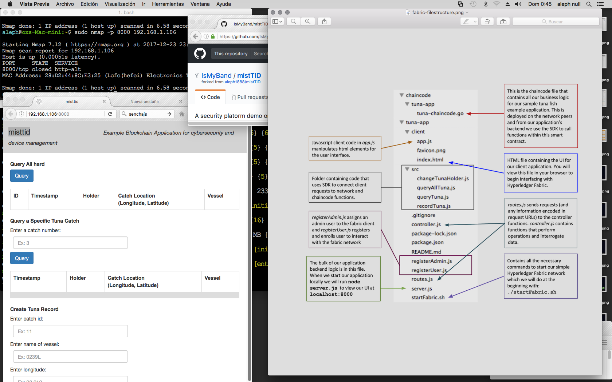

misttid app
===========

1.Description  
2.Installation  
3.Run  
4.Roadmap  
5.Contact  

  
1.Description
-------------
A distributed aplication for device, user, software and assets management and protection 

2.Installation
--------------

3.Run
------

4.Roadmap
---------
* Christmas 2017 tunaid-app
* 

5.Contact  
---------

## Hyperledger Fabric Sample Application

This application demonstrates the creation and transfer of tuna fish shipments between actors leveraging Hyperledger Fabric in the supply chain. In this exercise we will set up the minimum number of nodes required to develop chaincode. It has a single peer and a single organization.

if getting error about running ./startFabric.sh permission 

chmod a+x startFabric.sh

This code is based on code written by the Hyperledger Fabric community. Source code can be found here: (https://github.com/hyperledger/fabric-samples). 
